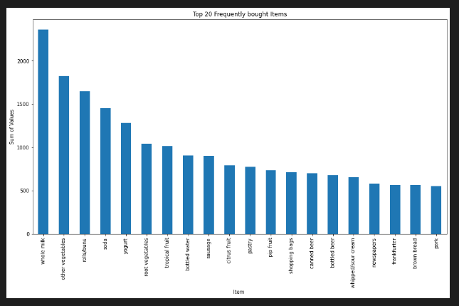
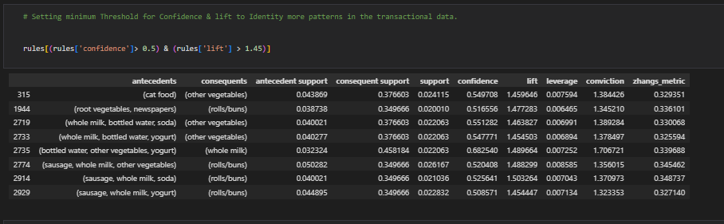

# FLIT-PROJECT- MARKET BASKET ANALYSIS IMPLEMENTATION

Product recommendations is a great way to drive sales by offering customers relevant products of interest. There are different algorithms used to generate product recommendations, For this Project,I Used — Association Rules (Market Basket Analysis).

Market Basket Analysis is a key technique used by data scientists to uncover associations between Products, This helps to discover interesting relationships, patterns, or associations within large datasets for large retailers(transactional data). Examples of such Could be To detect if the customers who purchase bread have a 60% likelihood to purchase Jam or Butter and customers who purchase laptops are more likely to purchase laptop Bags.

This analysis can be achieved Using Association Rule Mining (Apriori Algorithm), For this Project, I used the Apriori Algorithm to find the Association between the Itemsets and provide Recommendations on Products that Should be placed together to Increase The Organization's Revenue.

## TASK OBJECTIVE
This project captures End to End Market Basket Analysis for retail/E-commerce Transactional data, It aims to discover which Items are frequently purchased together and provide Recommendations, This will be achieved by performing Predictive Analysis using association rule mining (Apriori Algorithm). I've highlighted the Areas Covered and Tools used for this Project below.

OUTLINE 
1. Data Preparation
2. Exploratory Data Analysis (EDA)
3. Market Basket Analysis
4. Visualization
5. Observation and Insights
6. Recommendations

TOOLS USED FOR THE PROJECT
* Data Analysis Tool (Python: using Libries such as Pandas)
* Data Visualisation (Matplotlib & Seaborn)
* APriori Algorithm
* Jupyter Notebook

## PART 1- IMPORTING REQUIRED LIBRARIES, OS AND READING DATA 
I Imported the required libraries needed for the project such as Pandas, Matplolib, Seaborn, and Apriori Algorithm, loaded and Read the data into the Jupiter notebook as in the fig below: 

LOAD NECESSARY PACKAGES AND DATA 

## PART 2 - DATA PREPARATION &  EXPLORATORY DATA ANALYSIS
I performed the Data Cleaning and Exploratory Data Analysis and Check the data Information as listed Below:

1. View Top 10 Data 
2. Check the Total number of Row and columns and Datatypes
3. Check for missing Value
4. Review Top 20 most Purchased Itemset as well as the lowest purchase

## PART 3 -  MARKET BASKET ANALYSIS (Association Rule Mining - APRIORI ALGORITHM) 
Apriori Algorithm is a widely-used and well-known Association Rule algorithm and is a popular algorithm used in market basket analysis, Association Rule Mining is a technique that shows how items are associated with each other.

This part Includes:
1. Perform transactional Encoding
2. Set Minimum threshold 
3. Apply the Apriori algorithm to find frequent itemsets
4. Set Rules

PERFORM TRANSACTIONAL ENCODING
Transaction encoding is the process of converting transactional data into a binary matrix format where rows represent transactions and columns represent unique items. Each cell in the matrix indicates whether a particular item was present (1) or absent (0) in a transaction. This is essential so the computational purposes.

### APRIORI ALGORITHM
The Apriori algorithm is a commonly used algorithm for association rule mining. It uses a breadth-first search strategy to discover frequent itemsets and generate association rules efficiently. It uses the frequent itemset to generate the Association rule and it is based on the concept that subset of a frequent item set must also be a frequent item itself, So what exactly is frequent, Frequent Itemset is an Item whose support values is greater than a threshold ValueS.

This Algorithm Operate with three metrics which helps to measure the Associaton of Itemset namely: Support,Confidence,Lift,I Adoped this to filter out the items which have been bought less frequently and Identified most purchased Item. 

MEANING OF SUPPORT,CONFIDENCE AND LIFT

* Support is defined as the fraction of transactions that contain an item set. The higher the support the more frequently the itemset occurs. Given an itemset A, Support of A is the ratio of occurrence of itemset A in the Total list of transaction records

Confidence is a measure of how often the Items A or B occur Together given the number times it occurs.It is the probability that a transaction will contain itemset B given that the transaction contains itemset A.

Lift is a measure of the model performance. It helps to determine if combining a product with another improves the chances of making a sale.
Understanding Lift Score
If Lift > 1, this means that the association rule improves the chances of the outcome.
If Lift < 1, it means the association rule lessens the chances of the desired outcome.
If Lift = 1, it means that the association rule does not affect the outcome.

## PART 4 - FINDING & INSIGHT /OBSERVATION & FINDING

1INSIGHT 1. Exploratory Analysis shows the top 25 Product that are frequently bought by customer, with whole milk ranking Highest,See below:

INSIGHT 2. Having Set a High threshold for lift to (1.45) and Confidence to (0.5),The Result above Apriori prediction only 8 subset of Items that have a higher chance of being purchase together, as seen below :

1. customers who purchase Cat food have higher chance of buying Other vegatable
2. customers who purchase root vegetable have higher chance of buying rolls/buns
3. customers who purchase whole milk, bottled water, soda have higher chance of buying other vegetables
4. customers who purchase wwhole milk, bottled water, yogurt have higher chance of buying other vegetables
5. customers who purchase bottled water, other vegetables, yogurt have higher chance of buying whole milk
6. customers who purchase sausage, whole milk, other vegetables have higher chance of buying rolls/buns
7. customers who purchase sausage, whole milk, soda have higher chance of buying rolls/buns
7. customers who purchase sausage, whole milk, yogurt have higher chance of buying rolls/buns

INSIGHT 3. After setting Rule to the Highest lift and Confidence, Only one subset was filter out, This means that this Items are frequently purchased at all time and If placed together, It will increase the Revenue. 

This means that any customers who purchase sausage, whole milk, soda will definately purchase rolls/buns.
## PART 5 - RECOMMENDATION 

This Product Recommendation Analysis ( Market Basket Analysis) has provided list of Items and subset Item that are frequently purchased together,My Recommmedation are.

1. Since whole milk has been seen to have higher hold on customers, Hence the product should be made available up to 500%.
2. The most subset that has 150% likelyhood of being pick together is sausage, whole milk, soda and rolls/buns should be place together on the Stall 
3. The following Items: cat food & other vegatable, root vegetable should be placed together
4. rolls/buns, whole milk, bottle water, soda, yogurt, sausage, soda, yoghurt are Mostly purchased together at about 140%, So this Should be arrange together 
